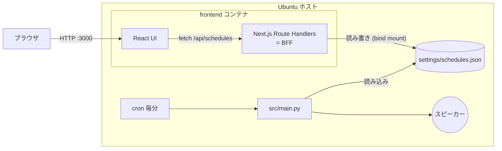

# スケジュール設定フロントエンド 概要設計書

作成日: 2026-07-09
更新日: 2026-07-10
ステータス: 主要事項確定(残る保留事項は [要件不足事項一覧](./schedule-ui-open-questions.md) の No.8・No.12 のみ)

## 1. 目的・背景

本プロジェクト(タイムアナウンスメント)は `settings/schedules.json` に記述された
曜日×時×分のスケジュールに従って `.wav` を再生する。
現状、スケジュール変更は JSON ファイルの手編集が必要であり、
これをブラウザ上の UI から「何時何分に音を鳴らすか」をボタン操作で設定できるようにする。

UI で設定した内容は `settings/schedules.json` に同期(書き込み)される。
再生側(`src/main.py`)は実行のたびにファイルを読み直すため、
**ファイルさえ更新されれば次回実行分から自動で反映される**(再生側の改修は不要)。

## 2. スコープ

| 項目 | 対象 |
| --- | --- |
| 対象 | スケジュール(月〜日および `holiday` の hour / minutes)の閲覧・追加・変更・削除、`schedules.json` への保存 |
| 対象外 | `minute_settings`(分ごとのサウンド指定)の編集、音声の再生そのもの、楽曲 DB(`db/music.sqlite3`)のマイグレーション、サウンドファイルのアップロード |
| 備考 | `minute_settings` は保存時も破壊せず温存する(No.1 確定。詳細は [要件不足事項一覧](./schedule-ui-open-questions.md) 参照) |

## 3. 技術選定

要件「現在エンジニア界隈で一番良いとされている言語とフレームワーク」に基づき、
2025〜2026 年の開発者調査を確認した。

### 3.1 調査結果

- **言語**: フロントエンド開発の事実上の標準は **TypeScript**。型による安全性が
  ファイル書き込みを伴う本用途(壊れた JSON を書くと再生が止まる)に合致する。
- **フロントエンドフレームワーク**: [Stack Overflow Developer Survey 2025](https://survey.stackoverflow.co/2025/technology)
  では **React が最多利用(プロ開発者の約 45〜47%)**。2 位グループ(Next.js 21.5%、Angular 19.8%、Vue 18.4%)を
  大きく引き離しており、2026 年の各種比較記事でも首位は変わらない
  ([Imaginary Cloud](https://www.imaginarycloud.com/blog/best-frontend-frameworks)、
  [Coderio](https://www.coderio.com/blog/software-development/guide-frontend-frameworks-2026/))。
  なお Svelte は満足度調査で上位だが利用率は約 7% と小さい。
- **React 公式の推奨**: React 公式ドキュメントは、新規アプリはフルスタックフレームワーク
  (筆頭に **Next.js**)で始めることを推奨している(react.dev "Creating a React App")。
- **BFF 用サーバ**: Node.js 系の比較([Encore: NestJS vs Fastify vs Hono (2026)](https://encore.dev/articles/nestjs-vs-fastify-vs-hono)、
  [Best Node.js Frameworks in 2026](https://www.hirenodejs.com/blog/nodejs-frameworks-compared-2026))では、
  BFF 用途は「薄く保てる軽量フレームワーク(Fastify / Hono)」が推奨とされる。
  ただし後述の通り、本件の規模では独立サーバを立てず Next.js に同居させる。

### 3.2 採用技術

| 区分 | 採用 | 根拠 |
| --- | --- | --- |
| 言語 | TypeScript | 業界標準(公式ベストプラクティス相当) |
| フロントエンド | React 19 + **Next.js(App Router)** | React が利用率首位、Next.js は React 公式推奨のフレームワーク |
| BFF | **Next.js Route Handlers**(`app/api/`) | Next.js 公式のサーバサイド API 機構。Node.js ランタイムで動くためファイル I/O が可能 |
| バリデーション | **Ajv**(JSON Schema バリデータ) | 既存の `settings/schema.json`(draft-07)をそのまま検証に流用できる ⭐私のオススメ |
| コンテナ | Docker(`node:22-slim` ベース) | Node.js 22 は LTS |

**構成上のポイント(⭐私のオススメ)**:
BFF を独立コンテナ(Fastify/Hono)にする案もあるが、本件の BFF の仕事は
「JSON ファイルの読み書きとバリデーション」のみで極めて薄い。
Next.js の Route Handlers が BFF の役割をそのまま担えるため、
**フロントエンド+BFF を 1 つの Next.js アプリ=1 コンテナに同居**させる構成を推奨する。
コンテナが 1 つ減り、フロント⇔BFF 間の型共有(zod/TypeScript 型)も単一リポジトリ内で完結する。
将来 BFF の責務が増えた場合(認証、複数クライアント対応など)に独立サーバへ切り出せばよい。

## 4. システム構成



- フロント用コンテナは Ubuntu ホスト上で起動し、ホストの `settings/` ディレクトリを
  **bind mount** してコンテナ内の BFF から直接ファイルを読み書きする。
- 再生側(Python)はホスト側で従来どおり動作し、同じファイルを読む。
  プロセス間の連携はファイルのみで行い、BFF と Python は互いを知らない(疎結合)。

## 5. 画面設計(イメージ)

1 画面構成。曜日タブ(`holiday` 含む全 8 タブ)+ 時刻グリッドで、ボタン操作で鳴動時刻を ON/OFF する。

```
┌──────────────────────────────────────────────────┐
│ タイムアナウンスメント 設定            [保存]     │
├──────────────────────────────────────────────────┤
│ [月] [火] [水] [木] [金] [土] [日] [祝]           │
├──────────────────────────────────────────────────┤
│  月曜日                                          │
│  ┌─────┬──────────────────────────────┬───────┐ │
│  │  9時 │[00●][05○][10○][15○][20○][25○]...[55○]│[削除]│ │
│  │ 10時 │[00●][05○][10○][15○][20○][25○]...[55○]│[削除]│ │
│  │ 17時 │[00●][05○][10○][15○][20○][25○]...[55○]│[削除]│ │
│  └─────┴──────────────────────────────┴───────┘ │
│  [+ 時間を追加]                    [月曜の設定を他曜日へコピー] │
├──────────────────────────────────────────────────┤
│ ⚠ 未保存の変更があります                          │
└──────────────────────────────────────────────────┘
```

初回アクセス時、`settings/schedules.json` が存在しない/バリデーションエラーで壊れている場合は
画面遷移前に選択ダイアログを表示する(No.9 確定)。

```
┌──────────────────────────────────┐
│ schedules.json が見つかりません   │
│ どのように始めますか?             │
│                                    │
│ [ 空の週間スケジュールで始める ]  │
│ [ サンプル設定からコピーして始める ]│
└──────────────────────────────────┘
```

- **分ボタン**: 各時間行に 0/5/10/…/55 の 5 分刻みボタン(1 時間あたり 12 個)を並べ、
  クリックで鳴動(●)/停止(○)をトグルする(No.10 確定)。
- **時間の追加/削除**: `[+ 時間を追加]` で 0〜23 時から未使用の時間を選んで行を追加。
- **保存**: 明示的な `[保存]` ボタン押下で BFF へ送信し、ファイルへ同期する(No.2 確定)。
- **曜日コピー**: サンプル設定を見ると平日 5 曜日が同一内容のため、
  曜日間コピー機能を付けると入力負荷が大幅に減る(⭐私のオススメ)。
- **手編集は非対応**: UI を唯一の編集手段とする(No.6 確定)。運用中に
  `schedules.json` を直接編集しないことを前提とする。

## 6. API 設計(BFF)

Next.js Route Handlers で実装する。ベースパス `/api`。

| メソッド | パス | 役割 |
| --- | --- | --- |
| GET | `/api/schedules` | `settings/schedules.json` を読み込んで返す。ファイルが無い/壊れている場合は `initialized: false` を含むレスポンスを返し、UI 側の初期化ダイアログ(No.9)を出す起点とする |
| PUT | `/api/schedules` | リクエストボディ(週間スケジュール全体)を検証してファイルへ書き込む。初回保存(未初期化からの保存)もこの PUT で行う |

- **PUT を全体置換にする理由**: 設定は「週間スケジュール 1 ファイル」で完結する小さなデータであり、
  差分更新(PATCH)より全体置換のほうが単純で、ファイルとの整合も取りやすい。
- レスポンス形式(成功時): `200` + 保存後のスケジュール本体。
- エラー形式:

| ステータス | 条件 | ボディ例 |
| --- | --- | --- |
| 400 | JSON Schema バリデーション違反 | `{ "error": "validation_failed", "details": [...] }`(Ajv のエラー配列) |
| 500 | ファイル I/O 失敗 | `{ "error": "io_error" }` |

- **同時編集(No.5 確定)**: 単一利用者・LAN 限定運用のため楽観ロックは導入しない。
  後勝ち(最後の PUT が有効)とする。
- **認証(No.4 確定)**: 家庭内 LAN・単一利用者のため認証機構は設けない。

## 7. ファイル同期設計(BFF 内部)

BFF は `schedules.json` を直接読み書きする。壊れたファイルを書くと再生側が
毎分エラーになるため、以下を必須とする。

1. **書き込み前バリデーション**: `settings/schema.json` を Ajv でコンパイルし、
   PUT ボディを検証。違反時はファイルに触れず 400 を返す。
2. **アトミック書き込み**(⭐私のオススメ。POSIX の定石):
   同一ディレクトリに一時ファイル(例 `.schedules.json.tmp`)を書き、
   `fsync` 後に `rename(2)` で置き換える。再生側(毎分 cron)が
   書き込み途中の半端なファイルを読む事故を構造的に防ぐ。
3. **直列化**: BFF プロセス内で書き込みを 1 本のキューに直列化する
   (Node.js 単一プロセスのため、モジュール内の Promise チェーンで十分)。
4. **文字コード・改行**: UTF-8、改行 LF(リポジトリの `.gitattributes` に準拠)、
   インデント 2 スペースで整形して書き込む。
5. **バックアップ(No.11 確定)**: 書き込み前に既存の `schedules.json` を
   `schedules.json.bak` として 1 世代分残す(上書き)。世代管理はせず、
   直前の 1 世代のみを保持する。

## 8. コンテナ・デプロイ構成

Ubuntu ホスト上に Docker でフロント用コンテナを 1 つ起動する。

```yaml
# docker-compose.yaml(イメージ)
services:
  schedule-ui:
    build: ./frontend            # Next.js アプリ(マルチステージビルド, node:22-slim)
    ports:
      - "3000:3000"              # 公開ポート(No.7 確定。外部公開しないため HTTPS 化は不要)
    volumes:
      - ./settings:/data/settings   # ホストの settings/ を bind mount
    environment:
      - SETTINGS_DIR=/data/settings
    restart: unless-stopped         # 起動管理方式は保留(要件不足事項一覧 No.12)
```

- Next.js は `output: 'standalone'` でビルドし、実行イメージを最小化する(Next.js 公式のセルフホスト手順)。
- BFF がファイルパスをハードコードせず `SETTINGS_DIR` 環境変数で受け取ることで、
  開発時(devcontainer)と本番(bind mount)の差を吸収する。
- コンテナ内ユーザーとホストの `settings/` の所有権(UID/GID)を合わせる必要があるが、
  ホスト側で cron を実行しているユーザーの UID/GID が未確認のため保留
  (要件不足事項一覧 No.8)。

## 9. ディレクトリ構成(案)

既存の Python プロジェクトと分離し、リポジトリ直下に `frontend/` を新設する。

```
/app
├── frontend/                  # 新設: Next.js (UI + BFF)
│   ├── app/
│   │   ├── page.tsx           # スケジュール設定画面
│   │   └── api/
│   │       └── schedules/route.ts   # GET / PUT(BFF)
│   ├── lib/
│   │   ├── schedule-store.ts  # ファイル読み書き(アトミック書き込み・直列化)
│   │   └── validator.ts       # Ajv + settings/schema.json
│   ├── Dockerfile
│   └── package.json
├── settings/                  # 既存(schema.json はフロントと共用)
├── src/                       # 既存(変更なし)
└── docs/                      # 本設計書
```

## 10. ベストプラクティス準拠状況の整理

要件「ベストプラクティスにないものはオススメとして分かるように」への対応表。

| 設計判断 | 位置づけ |
| --- | --- |
| TypeScript + React の採用 | 業界調査に基づく(利用率首位) |
| React アプリを Next.js で構築 | React 公式ドキュメントの推奨 |
| Route Handlers で API を実装 | Next.js 公式機能・公式ドキュメント準拠 |
| `output: 'standalone'` での Docker 化 | Next.js 公式のセルフホスト手順 |
| BFF を独立させず Next.js に同居 | ⭐私のオススメ(規模に対する判断。公式が禁止しているわけではない) |
| Ajv で既存 schema.json を流用 | ⭐私のオススメ(schema.json という既存資産を活かす) |
| アトミック書き込み(tmp + rename) | ⭐私のオススメ(POSIX の定石だが、特定 FW の公式手順ではない) |
| 明示保存ボタン方式 | 確定(No.2)。ユーザー判断 |
| 曜日間コピー機能 | ⭐私のオススメ(要件外の利便機能) |
| 保存前 `.bak` 1 世代保持 | 確定(No.11)。ユーザー判断 |
| 5 分刻みの分ボタン | 確定(No.10)。ユーザー判断 |
| 未初期化時の選択ダイアログ(空/サンプル複製) | 確定(No.9)。ユーザー判断 |
| UI を唯一の編集手段とする | 確定(No.6)。ユーザー判断(手編集は非対応) |

## 11. 参考資料

- [Stack Overflow Developer Survey 2025 — Technology](https://survey.stackoverflow.co/2025/technology)
- [Best Frontend Frameworks for 2026 (Imaginary Cloud)](https://www.imaginarycloud.com/blog/best-frontend-frameworks)
- [Best Frontend Frameworks 2026 (Coderio)](https://www.coderio.com/blog/software-development/guide-frontend-frameworks-2026/)
- [NestJS vs Fastify vs Hono: The 2026 Node.js Comparison (Encore)](https://encore.dev/articles/nestjs-vs-fastify-vs-hono)
- [Best Node.js Frameworks in 2026 (HireNodeJS)](https://www.hirenodejs.com/blog/nodejs-frameworks-compared-2026)
