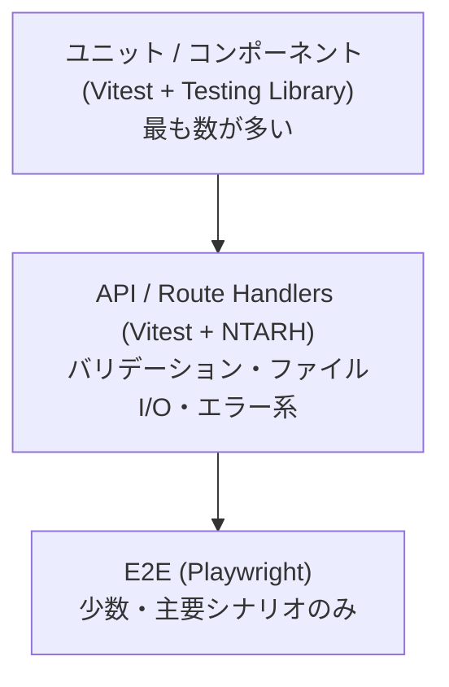

# スケジュール設定フロントエンド テスト設計書

作成日: 2026-07-10
対象: [概要設計書](./schedule-ui-overview-design.md)、[要件不足事項一覧](./schedule-ui-open-questions.md)
関連キャッチアップ教材: [docs/catch-up/nodejs-test-frameworks/index.html](./catch-up/nodejs-test-frameworks/index.html)

## 1. 目的・背景

本プロジェクトの実装は**テスト駆動開発(TDD)**を採用する。
「壊れた JSON を書くと再生側(`src/main.py`)が毎分エラーになる」というリスクが
[概要設計書](./schedule-ui-overview-design.md) 7章で明記されており、
バリデーション・アトミック書き込み・バックアップといった安全装置は
先にテストで仕様を固めてから実装するほうが手戻りが少ない。

この文書は、採用するテストツールとレイヤーごとの方針を定める。
ツール選定の調査過程は [docs/catch-up/nodejs-test-frameworks/](./catch-up/nodejs-test-frameworks/index.html) を参照。

## 2. テスト戦略の全体像

3層のテストピラミッドを採用する。下の層ほど数を多く・実行を高速にし、
上の層(E2E)は主要シナリオに絞る。



| 層 | 目的 | 実行頻度の想定 |
| --- | --- | --- |
| ユニット/コンポーネント | 純粋関数(バリデーション・整形処理)とUI部品(ボタンのON/OFF等)の振る舞い確認 | 保存のたびに watch mode で実行 |
| API(Route Handlers) | `/api/schedules` の GET/PUT がスキーマ・エラー処理・ファイルI/Oを正しく扱うか | コミット前・CI |
| E2E | 画面をまたぐ主要シナリオ(初期化・編集・保存・再読み込み)が実際に動くか | CI(PR時) |

## 3. 採用技術

| 区分 | 採用 | 根拠 |
| --- | --- | --- |
| ユニット/コンポーネントテストランナー | **Vitest** | Next.js 公式ドキュメントが手順を掲載。ESM/TypeScript がそのまま動き、Jest 比で高速。State of JS 2025 でも利用率・満足度ともに上昇傾向 |
| コンポーネントテスト | **React Testing Library** | 実装詳細ではなくユーザー視点(ロール・表示テキスト)でテストする業界標準 |
| API(Route Handlers)テスト | **Vitest + next-test-api-route-handler(NTARH)** | `NextRequest`/`NextResponse` をそのまま扱える Next.js 専用の分離実行環境 |
| 外部APIモック | **MSW(Mock Service Worker)** | ネットワークレベルでインターセプトするため HTTP クライアント実装に依存しない。現状は外部 API 通信がないため即時導入は必須ではないが、標準として採用しておく |
| E2E | **Playwright** | State of JS 2025 で "Most Adopted" ツール。並列実行・トレースビューアが無料。非同期 Server Component の検証を担う |
| バリデーション(再掲) | Ajv([概要設計書](./schedule-ui-overview-design.md) 3.2 節で確定済み) | 既存 `settings/schema.json` を流用 |

⭐私のオススメ: MSW は現時点で必須ではないが、将来的な外部連携(通知APIなど)に備えて
テスト基盤の一部として最初から入れておくと、あとから導入コストを払わずに済む。

## 4. レイヤー別テスト方針

### 4.1 ユニット/コンポーネント(Vitest + React Testing Library)

- 対象: `lib/schedule-store.ts`(ファイル読み書き・アトミック書き込み・`.bak` 生成ロジック)、
  `lib/validator.ts`(Ajv ラッパー)、画面コンポーネント(時刻グリッド・曜日タブ・初期化選択ダイアログ)
- 環境: `environment: 'jsdom'`([キャッチアップ教材 04](./catch-up/nodejs-test-frameworks/concepts/04-nextjs-considerations.html) 参照)
- 非同期 Server Component は対象外とし、E2E に委ねる([要件不足事項一覧](./schedule-ui-open-questions.md) の設計判断に準拠)
- 具体的な確認観点の例:
  - 5 分刻みボタン(0/5/…/55)のトグルで内部状態が正しく更新される(No.10 確定事項に対応)
  - 曜日間コピー機能が対象曜日のみを上書きする
  - `holiday` タブが他の曜日と同じ UI で操作できる(No.1 確定事項に対応)
  - 未保存の変更がある状態で保存前バリデーションエラーが出た場合、画面遷移しない

### 4.2 API / Route Handlers(Vitest + NTARH)

- 対象: `app/api/schedules/route.ts` の GET/PUT
- `readSchedules`/`writeSchedules` などファイル I/O 関数は `vi.spyOn`/`vi.mock` で差し替え、
  実ファイルには触れない([キャッチアップ教材 05](./catch-up/nodejs-test-frameworks/concepts/05-route-handlers-testing.html) 参照)
- 確認観点:
  - GET: ファイルが存在する場合は内容を返す。存在しない/バリデーションエラーの場合は
    `initialized: false` を返す(No.9 確定事項に対応)
  - PUT: スキーマ違反時は 400 を返し、ファイルに一切書き込まない
  - PUT: 書き込み成功時、書き込み前に `.bak` が 1 世代分作られる(No.11 確定事項に対応)
  - PUT: 書き込みはアトミック(tmp + rename)である前提のため、
    書き込み処理中に例外が発生しても本ファイルは破損しないことを確認する
  - `minute_settings` を含むスケジュールを GET → PUT した際、`minute_settings` が温存される(No.1 確定事項に対応)

### 4.3 E2E(Playwright)

- 対象: ブラウザを介した主要シナリオのみ。ユニット/APIで担保できる内容は重複させない
- 確認観点([キャッチアップ教材 07](./catch-up/nodejs-test-frameworks/concepts/07-playwright-e2e.html) 参照):
  1. `schedules.json` が存在しない状態でアクセス→初期化ダイアログが表示される→
     「空で始める」を選択→保存できる(No.9 確定事項に対応)
  2. 曜日タブを切り替えて時刻をトグル→保存→ページ再読み込み後も反映されている
  3. 保存前に未保存インジケーターが表示され、保存後に消える(No.2 確定事項に対応)

## 5. TDD の進め方

1. **Red**: 実装対象の振る舞いを表すテストを先に書き、失敗することを確認する
2. **Green**: テストを通す最小限の実装を書く
3. **Refactor**: テストが通った状態を保ったまま、実装を整理する

- レイヤーの選び方: 純粋関数やUI部品の単位で TDD を回す場合はユニット層、
  API の入出力契約から入る場合は API 層のテストを先に書いてから実装する
- watch mode(`vitest`)を開発中は常時起動しておく

## 6. ディレクトリ構成

このリポジトリ自体が Next.js の `src/` ディレクトリ構成のプロジェクトである
([概要設計書](./schedule-ui-overview-design.md) 9章)。

```
/app
├── vitest.config.mts
├── playwright.config.ts
├── vitest.setup.ts            # jest-dom マッチャ登録・MSW の setupServer 起動
├── mocks/
│   ├── handlers.ts
│   └── server.ts
├── src/
│   ├── __tests__/             # ユニット/コンポーネントテスト
│   │   ├── schedule-store.test.ts
│   │   ├── validator.test.ts
│   │   └── components/        # UI 実装時に追加(schedule-grid.test.tsx 等)
│   ├── lib/
│   │   ├── paths.ts
│   │   ├── schedule-store.ts
│   │   ├── validator.ts
│   │   └── types.ts
│   └── app/
│       ├── layout.tsx
│       ├── page.tsx
│       └── api/schedules/
│           ├── route.ts
│           └── route.test.ts  # NTARH での API テスト
└── e2e/
    └── smoke.spec.ts          # UI 実装後に主要シナリオ(schedule-editing.spec.ts 等)を追加
```

> ユニット/API テストは file 冒頭の環境ディレクティブで使い分ける。既定は jsdom
> (テスト設計 4.1)、ファイル I/O や Route Handler を扱うテスト(`schedule-store.test.ts`・
> `validator.test.ts`・`route.test.ts`)は先頭に `// @vitest-environment node` を置く。

## 7. CI 実行方針

- `npm run test`(Vitest, `vitest run`): ユニット/コンポーネント・APIテストをまとめて実行
- `npm run test:e2e`(`playwright test`): E2E テストを実行
- PR 作成時に両方を CI で実行する(具体的な CI 構成は devcontainer/運用の後続タスクで整備)

## 8. 参考資料

- [Node.js テストフレームワーク キャッチアップ教材](./catch-up/nodejs-test-frameworks/index.html)
- [Next.js Testing: Vitest](https://nextjs.org/docs/app/guides/testing/vitest)
- [Vitest 公式ドキュメント](https://vitest.dev/)
- [React Testing Library 公式ドキュメント](https://testing-library.com/docs/react-testing-library/intro/)
- [next-test-api-route-handler](https://github.com/Xunnamius/next-test-api-route-handler)
- [Mock Service Worker 公式ドキュメント](https://mswjs.io/docs/)
- [Playwright 公式ドキュメント](https://playwright.dev/)
- [State of JavaScript 2025 — Testing](https://2025.stateofjs.com/en-US/libraries/testing/)
